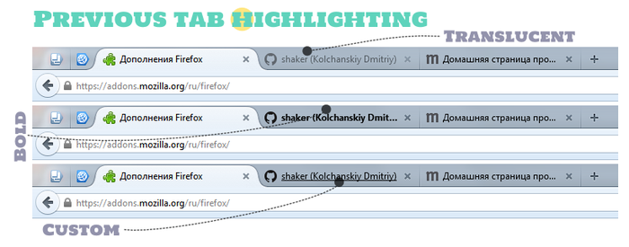

# Previous tab highlighting addon for Firefox

When switching between multiple tabs, often there is a situation when you forget which tab you were before switching to the other one. This small extension solves this problem by highlighting the previous tab.
There are two styles to choose: to highlight the text tab in bold or apply the translucency of the whole tab. Also it is possible to specify custom CSS-property.

# Changelog
1.2.1:
Fixed: selected styles in the settings didn't work.
Improved: after select of style it applies to tabs.

1.2:
Improved: Now highlighting occurs within a window, rather than in the entire application.
